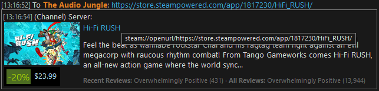
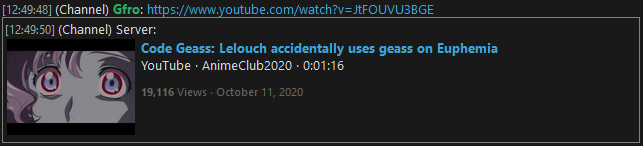
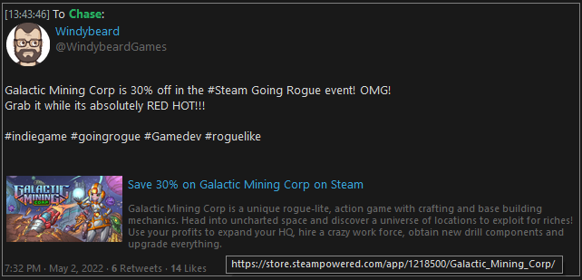
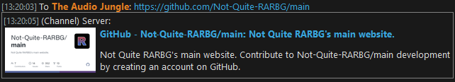

# Mumble Media Cards

Twitter-style summary cards for media links. Links posted by users are followed up with thumbnails and additional metadata.

This plugin uses the [Ice protocol](https://wiki.mumble.info/wiki/Ice) to connect to a Mumble (Murmur) server.

We support a handful of popular services:

### Steam

Games, workshop files, community content, all generate custom cards with links that will open within the Steam client:



### YouTube

YouTube links will be converted to a video thumbnail with viewers and length information.

**This features requires an API key from a Google Cloud account for access to the YouTube Data API v3.**



### Twitter

Twitter links will display tweet author, message, and thumbnails wherever possible.

**This feature requires a bearer token from [Twitter's Developer Portal](developer.twitter.com)**.



### Other Websites

Wherever possible, it will try to extract OpenGraph and other metadata from URLs to generate a useful summary card:




## Installation

Easiest method for installation is done via Docker. Here's a sample docker-compose:

```yml
---
version: '3'
services:
  cards:
    image: mcmanning/mumble-summary-cards
    restart: unless-stopped
    # If you're also installing murmur via compose, include this
    # dependency to ensure the Ice server is setup first.
    depends_on:
      - murmur
    environment:
      - ICE_HOST=murmur
      - ICE_PORT=6502
      - ICE_SECRET=${ICE_SECRET}
      - YOUTUBE_API_KEY=${YOUTUBE_API_KEY}
      - TWITTER_BEARER_TOKEN=${TWITTER_BEARER_TOKEN}
```

## Local Development

Add the following envvars before running:

```ini
ICE_HOST=<your murmur host instance>
ICE_PORT=6502
ICE_SECRET=<your murmur ice secret>
YOUTUBE_API_KEY=<your API key, optional>
TWITTER_BEARER_TOKEN=<your bearer token, optional>
```

Adding `DEBUG=1` as an envvar will enable verbose logging.

Setup your virtualenv and install from requirements:

```
python -m venv venv
./venv/Scripts/activate
pip install -r requirements.txt
```

`zeroc-ice` takes a while to compile and you may need additional build tools depending on your machine. Take a look at the Dockerfile for full requirements.

Once you're all setup, run from `entry.py`.
